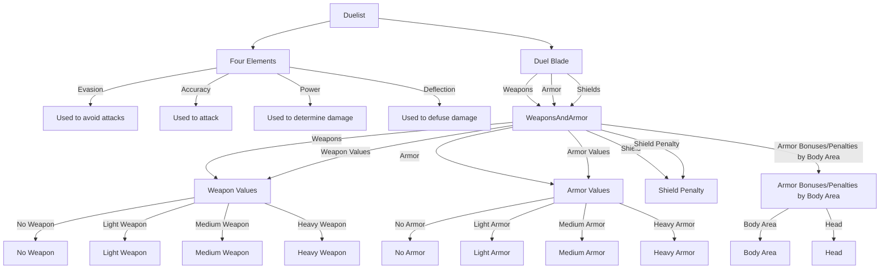

```mermaid
graph TD;
  Duelist --> FourElements[Four Elements]
  FourElements -->|Evasion| Evasion[Used to avoid attacks]
  FourElements -->|Accuracy| Accuracy[Used to attack]
  FourElements -->|Power| Power[Used to determine damage]
  FourElements -->|Deflection| Deflection[Used to defuse damage]

  Duelist --> DuelBlade[Duel Blade]
  DuelBlade -->|Weapons| WeaponsAndArmor
  DuelBlade -->|Armor| WeaponsAndArmor
  DuelBlade -->|Shields| WeaponsAndArmor

  WeaponsAndArmor -->|Weapons| WeaponValues[Weapon Values]
  WeaponsAndArmor -->|Armor| ArmorValues[Armor Values]
  WeaponsAndArmor -->|Shield| ShieldPenalty[Shield Penalty]
  WeaponsAndArmor -->|Weapon Values| WeaponValues
  WeaponsAndArmor -->|Armor Values| ArmorValues
  WeaponsAndArmor -->|Shield Penalty| ShieldPenalty
  WeaponsAndArmor -->|Armor Bonuses/Penalties by Body Area| ArmorBonusesPenalties[Armor Bonuses/Penalties by Body Area]

  WeaponValues -->|No Weapon| NoWeapon[No Weapon]
  WeaponValues -->|Light Weapon| LightWeapon[Light Weapon]
  WeaponValues -->|Medium Weapon| MediumWeapon[Medium Weapon]
  WeaponValues -->|Heavy Weapon| HeavyWeapon[Heavy Weapon]

  ArmorValues -->|No Armor| NoArmor[No Armor]
  ArmorValues -->|Light Armor| LightArmor[Light Armor]
  ArmorValues -->|Medium Armor| MediumArmor[Medium Armor]
  ArmorValues -->|Heavy Armor| HeavyArmor[Heavy Armor]

  ArmorBonusesPenalties -->|Body Area| BodyArea[Body Area]
  ArmorBonusesPenalties -->|Head| Head[Head]
```