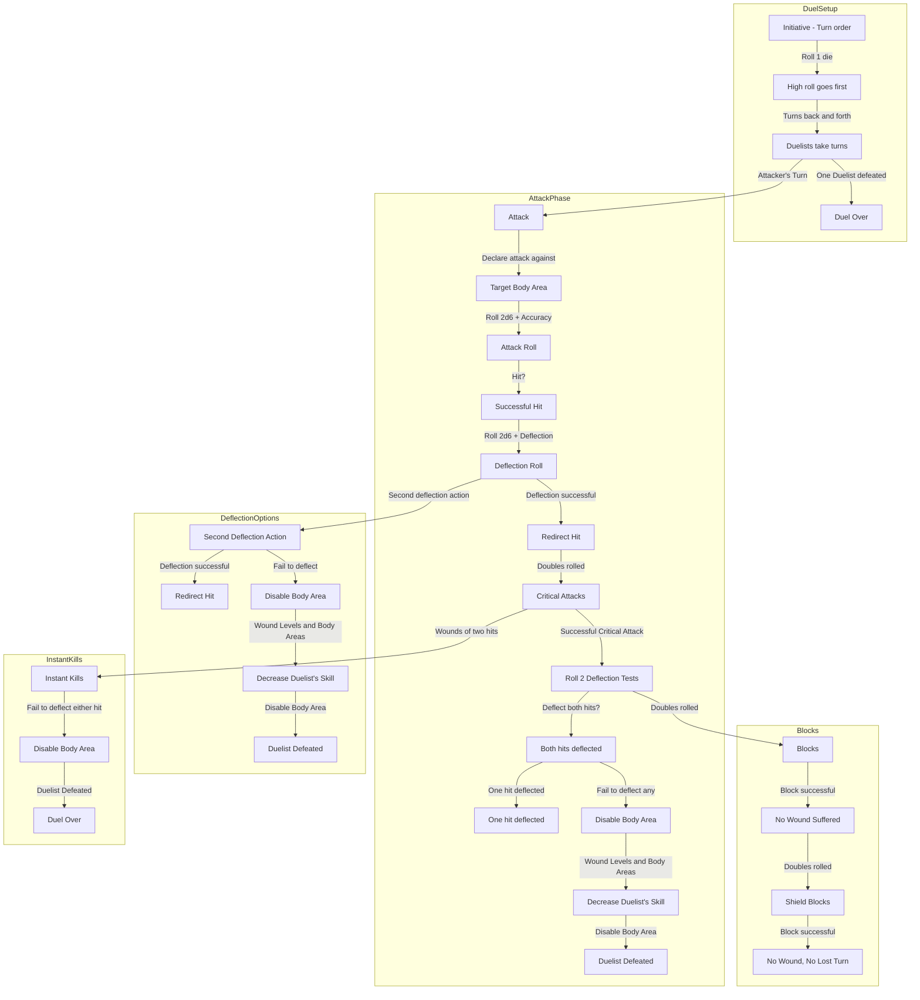

```mermaid
graph TD;
  subgraph DuelSetup
    A[Initiative - Turn order] -->|Roll 1 die| B[High roll goes first]
    B -->|Turns back and forth| C[Duelists take turns]
    C -->|One Duelist defeated| D[Duel Over]
  end

  subgraph AttackPhase
    C -->|Attacker's Turn| E[Attack]
    E -->|Declare attack against| F[Target Body Area]
    F -->|Roll 2d6 + Accuracy| G[Attack Roll]
    G -->|Hit?| H[Successful Hit]
    H -->|Roll 2d6 + Deflection| I[Deflection Roll]
    I -->|Deflection successful| J[Redirect Hit]
    J -->|Doubles rolled| K[Critical Attacks]
    K -->|Successful Critical Attack| L[Roll 2 Deflection Tests]
    L -->|Deflect both hits?| M[Both hits deflected]
    M -->|One hit deflected| N[One hit deflected]
    M -->|Fail to deflect any| O[Disable Body Area]
    O -->|Wound Levels and Body Areas| P[Decrease Duelist's Skill]
    P -->|Disable Body Area| Q[Duelist Defeated]
  end

  subgraph DeflectionOptions
    I -->|Second deflection action| R[Second Deflection Action]
    R -->|Deflection successful| S[Redirect Hit]
    R -->|Fail to deflect| T[Disable Body Area]
    T -->|Wound Levels and Body Areas| U[Decrease Duelist's Skill]
    U -->|Disable Body Area| V[Duelist Defeated]
  end

  subgraph Blocks
    L -->|Doubles rolled| W[Blocks]
    W -->|Block successful| X[No Wound Suffered]
    X -->|Doubles rolled| Y[Shield Blocks]
    Y -->|Block successful| Z[No Wound, No Lost Turn]
  end

  subgraph InstantKills
    K -->|Wounds of two hits| AA[Instant Kills]
    AA -->|Fail to deflect either hit| BB[Disable Body Area]
    BB -->|Duelist Defeated| CC[Duel Over]
  end
```